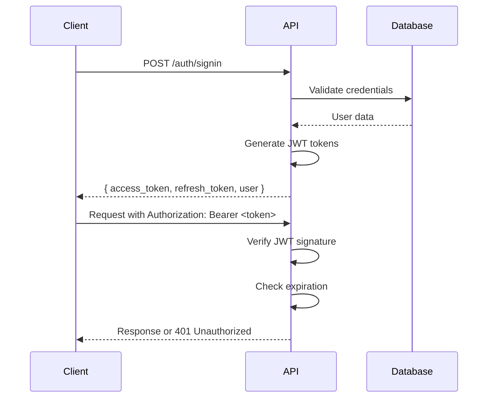

# 📚 Fintrax API Documentation V3

**API RESTful completa para Fintrax V3** - Documentación detallada de endpoints, modelos y flujos.

> 💡 **API con score 95/100** construida con NestJS, Prisma y PostgreSQL.

---

## 📋 Tabla de Contenidos

1. [Base URL](#1-base-url)
2. [Autenticación](#2-autenticación)
3. [Endpoints](#3-endpoints)
4. [Modelos de Datos](#4-modelos-de-datos)
5. [Códigos de Error](#5-códigos-de-error)
6. [Rate Limiting](#6-rate-limiting)
7. [Ejemplos de Uso](#7-ejemplos-de-uso)

---

## 1. BASE URL

```bash
# 🏗️ Desarrollo
https://localhost:3000/api/v1

# 🚀 Producción
https://api.fintrax.io/api/v1
```

---

## 2. AUTENTICACIÓN

### 2.1 JWT Authentication Flow



### 2.2 Headers Required

```http
Authorization: Bearer <jwt_access_token>
Content-Type: application/json
```

### 2.3 Token Structure

```json
{
  "access_token": "eyJhbGciOiJIUzI1NiIsInR5cCI6IkpXVCJ9...",
  "refresh_token": "eyJhbGciOiJIUzI1NiIsInR5cCI6IkpXVCJ9...",
  "expires_in": 3600,
  "token_type": "Bearer",
  "user": {
    "id": "cuid-123",
    "email": "user@example.com",
    "name": "John Doe"
  }
}
```

---

## 3. ENDPOINTS

### 3.1 Autenticación

#### `POST /auth/signup`
Registra un nuevo usuario en el sistema.

**Request Body:**
```json
{
  "email": "user@example.com",
  "password": "securePassword123",
  "name": "John Doe"
}
```

**Response (201):**
```json
{
  "message": "User created successfully",
  "user": {
    "id": "cuid-123",
    "email": "user@example.com",
    "name": "John Doe",
    "createdAt": "2024-05-12T10:00:00Z"
  }
}
```

**Possible Errors:**
- `400 Bad Request` - Datos inválidos
- `409 Conflict` - Email ya existe

---

#### `POST /auth/signin`
Inicia sesión y retorna tokens JWT.

**Request Body:**
```json
{
  "email": "user@example.com",
  "password": "securePassword123"
}
```

**Response (200):**
```json
{
  "access_token": "eyJhbGciOiJIUzI1NiIsInR5cCI6IkpXVCJ9...",
  "refresh_token": "eyJhbGciOiJIUzI1NiIsInR5cCI6IkpXVCJ9...",
  "expires_in": 3600,
  "token_type": "Bearer",
  "user": {
    "id": "cuid-123",
    "email": "user@example.com",
    "name": "John Doe"
  }
}
```

**Possible Errors:**
- `401 Unauthorized` - Credenciales inválidas
- `400 Bad Request` - Datos incompletos

---

#### `POST /auth/refresh`
Refresca el access token usando el refresh token.

**Request Body:**
```json
{
  "refresh_token": "eyJhbGciOiJIUzI1NiIsInR5cCI6IkpXVCJ9..."
}
```

**Response (200):**
```json
{
  "access_token": "eyJhbGciOiJIUzI1NiIsInR5cCI6IkpXVCJ9...",
  "expires_in": 3600,
  "token_type": "Bearer"
}
```

---

#### `GET /auth/me`
Obtiene el perfil del usuario autenticado.

**Headers:**
```http
Authorization: Bearer <access_token>
```

**Response (200):**
```json
{
  "id": "cuid-123",
  "email": "user@example.com",
  "name": "John Doe",
  "createdAt": "2024-05-12T10:00:00Z",
  "updatedAt": "2024-05-12T10:00:00Z"
}
```

---

### 3.2 Estado Financiero

#### `GET /financial/state`
Obtiene el estado financiero completo del usuario.

**Headers:**
```http
Authorization: Bearer <access_token>
```

**Response (200):**
```json
{
  "confirmedBalance": {
    "totalBalance": 2500.00,
    "availableBalance": 1800.00,
    "allocatedBalance": 700.00,
    "expectedBalance": 2500.00
  },
  "savingsRate": {
    "confirmed": 28.5,
    "expected": 30.0
  },
  "alerts": {
    "isNegativeBalance": false,
    "pendingTransactions": 2,
    "lowSavingsRate": false
  },
  "transactions": [
    {
      "id": "tx-123",
      "type": "INCOME",
      "amount": 2000.00,
      "status": "COMPLETED",
      "description": "Salary",
      "transactionDate": "2024-05-01",
      "createdAt": "2024-05-01T09:00:00Z"
    }
  ],
  "goals": [
    {
      "id": "goal-123",
      "name": "Vacaciones",
      "targetAmount": 1000.00,
      "currentAmount": 300.00,
      "status": "ACTIVE",
      "priority": "MEDIUM",
      "targetDate": "2024-12-31",
      "progress": {
        "percentage": 30.0,
        "remaining": 700.00
      },
      "timeline": {
        "isOnTrack": true,
        "daysRemaining": 203,
        "monthlyVelocity": 50.00
      }
    }
  ],
  "recommendations": [
    "Tu tasa de ahorro es buena. Considera invertir el exceso.",
    "Tienes 2 transacciones pendientes de confirmación."
  ]
}
```

**Rate Limit:** 100 requests por minuto

---

#### `POST /financial/allocate-goal`
Asigna fondos a una meta de ahorro.

**Headers:**
```http
Authorization: Bearer <access_token>
```

**Request Body:**
```json
{
  "amount": 100.00,
  "goalId": "goal-123",
  "note": "Contribución mensual"
}
```

**Response (200):**
```json
{
  "success": true,
  "goal": {
    "id": "goal-123",
    "name": "Vacaciones",
    "targetAmount": 1000.00,
    "currentAmount": 400.00,
    "status": "ACTIVE"
  },
  "transaction": {
    "id": "tx-456",
    "type": "ALLOCATION",
    "amount": 100.00,
    "status": "COMPLETED",
    "description": "Goal allocation: Vacaciones",
    "createdAt": "2024-05-12T10:30:00Z"
  },
  "updatedState": {
    "availableBalance": 1700.00,
    "allocatedBalance": 800.00
  }
}
```

**Possible Errors:**
- `400 Bad Request` - Fondos insuficientes, monto inválido
- `404 Not Found` - Meta no existe
- `409 Conflict` - Meta completada

**Rate Limit:** 50 requests por minuto

---

#### `POST /financial/deallocate-goal`
Desasigna fondos de una meta de ahorro.

**Headers:**
```http
Authorization: Bearer <access_token>
```

**Request Body:**
```json
{
  "amount": 50.00,
  "goalId": "goal-123",
  "note": "Ajuste de presupuesto"
}
```

**Response (200):**
```json
{
  "success": true,
  "goal": {
    "id": "goal-123",
    "name": "Vacaciones",
    "targetAmount": 1000.00,
    "currentAmount": 350.00,
    "status": "ACTIVE"
  },
  "transaction": {
    "id": "tx-457",
    "type": "DEALLOCATION",
    "amount": 50.00,
    "status": "COMPLETED",
    "description": "Goal deallocation: Vacaciones",
    "createdAt": "2024-05-12T10:35:00Z"
  },
  "updatedState": {
    "availableBalance": 1750.00,
    "allocatedBalance": 750.00
  }
}
```

**Rate Limit:** 50 requests por minuto

---

### 3.3 Transacciones

#### `GET /transactions`
Obtiene lista de transacciones del usuario.

**Headers:**
```http
Authorization: Bearer <access_token>
```

**Query Parameters:**
- `status` (optional): Filter by status (`PENDING`, `COMPLETED`, `FAILED`)
- `type` (optional): Filter by type (`INCOME`, `EXPENSE`, `ALLOCATION`, `DEALLOCATION`)
- `month` (optional): Filter by month in format `YYYY-MM`
- `limit` (optional): Number of results (default: 50, max: 100)
- `offset` (optional): Pagination offset (default: 0)

**Example Request:**
```http
GET /transactions?status=COMPLETED&type=INCOME&month=2024-05&limit=20
```

**Response (200):**
```json
{
  "transactions": [
    {
      "id": "tx-123",
      "type": "INCOME",
      "amount": 2000.00,
      "status": "COMPLETED",
      "description": "Salary",
      "category": "SALARY",
      "transactionDate": "2024-05-01",
      "confirmedDate": "2024-05-02",
      "metadata": {
        "source": "direct_deposit",
        "employer": "Tech Company"
      },
      "createdAt": "2024-05-01T09:00:00Z",
      "updatedAt": "2024-05-02T10:00:00Z"
    },
    {
      "id": "tx-124",
      "type": "EXPENSE",
      "amount": 150.00,
      "status": "COMPLETED",
      "description": "Grocery shopping",
      "category": "FOOD",
      "transactionDate": "2024-05-03",
      "confirmedDate": "2024-05-03",
      "metadata": {
        "merchant": "Supermarket",
        "payment_method": "credit_card"
      },
      "createdAt": "2024-05-03T14:30:00Z",
      "updatedAt": "2024-05-03T14:30:00Z"
    }
  ],
  "pagination": {
    "total": 45,
    "limit": 20,
    "offset": 0,
    "hasMore": true
  }
}
```

**Rate Limit:** 200 requests por minuto

---

#### `POST /transactions`
Crea una nueva transacción.

**Headers:**
```http
Authorization: Bearer <access_token>
```

**Request Body:**
```json
{
  "type": "EXPENSE",
  "amount": 75.50,
  "description": "Restaurant dinner",
  "category": "ENTERTAINMENT",
  "transactionDate": "2024-05-12",
  "metadata": {
    "merchant": "Italian Restaurant",
    "payment_method": "credit_card"
  }
}
```

**Response (201):**
```json
{
  "id": "tx-458",
  "type": "EXPENSE",
  "amount": 75.50,
  "status": "PENDING",
  "description": "Restaurant dinner",
  "category": "ENTERTAINMENT",
  "transactionDate": "2024-05-12",
  "metadata": {
    "merchant": "Italian Restaurant",
    "payment_method": "credit_card"
  },
  "createdAt": "2024-05-12T19:00:00Z",
  "updatedAt": "2024-05-12T19:00:00Z"
}
```

---

#### `GET /transactions/:id`
Obtiene una transacción específica.

**Headers:**
```http
Authorization: Bearer <access_token>
```

**Response (200):**
```json
{
  "id": "tx-123",
  "type": "INCOME",
  "amount": 2000.00,
  "status": "COMPLETED",
  "description": "Salary",
  "category": "SALARY",
  "transactionDate": "2024-05-01",
  "confirmedDate": "2024-05-02",
  "metadata": {
    "source": "direct_deposit",
    "employer": "Tech Company"
  },
  "createdAt": "2024-05-01T09:00:00Z",
  "updatedAt": "2024-05-02T10:00:00Z",
  "goalContributions": [
    {
      "goalId": "goal-123",
      "goalName": "Vacaciones",
      "amount": 300.00
    }
  ]
}
```

---

### 3.4 Metas de Ahorro

#### `GET /goals`
Obtiene lista de metas de ahorro del usuario.

**Headers:**
```http
Authorization: Bearer <access_token>
```

**Query Parameters:**
- `status` (optional): Filter by status (`ACTIVE`, `COMPLETED`, `PAUSED`, `ABANDONED`)
- `priority` (optional): Filter by priority (`LOW`, `MEDIUM`, `HIGH`)

**Response (200):**
```json
{
  "goals": [
    {
      "id": "goal-123",
      "name": "Vacaciones",
      "description": "Viaje a la playa",
      "category": "TRAVEL",
      "targetAmount": 1000.00,
      "currentAmount": 400.00,
      "status": "ACTIVE",
      "priority": "MEDIUM",
      "sourceType": "FROM_BALANCE",
      "targetDate": "2024-12-31",
      "createdAt": "2024-01-15T10:00:00Z",
      "updatedAt": "2024-05-12T10:30:00Z",
      "progress": {
        "percentage": 40.0,
        "remaining": 600.00,
        "contributions": 8
      },
      "timeline": {
        "isOnTrack": true,
        "daysRemaining": 203,
        "monthlyVelocity": 50.00,
        "requiredVelocity": 49.26
      },
      "alerts": []
    },
    {
      "id": "goal-124",
      "name": "Laptop nuevo",
      "description": "MacBook Pro para trabajo",
      "category": "TECHNOLOGY",
      "targetAmount": 2000.00,
      "currentAmount": 150.00,
      "status": "ACTIVE",
      "priority": "HIGH",
      "sourceType": "FROM_BALANCE",
      "targetDate": "2024-08-31",
      "createdAt": "2024-02-01T10:00:00Z",
      "updatedAt": "2024-05-12T10:30:00Z",
      "progress": {
        "percentage": 7.5,
        "remaining": 1850.00,
        "contributions": 3
      },
      "timeline": {
        "isOnTrack": false,
        "daysRemaining": 111,
        "monthlyVelocity": 50.00,
        "requiredVelocity": 500.00
      },
      "alerts": [
        {
          "type": "BEHIND_SCHEDULE",
          "message": "You're behind schedule. Increase monthly contributions to $500.00"
        }
      ]
    }
  ]
}
```

---

#### `POST /goals`
Crea una nueva meta de ahorro.

**Headers:**
```http
Authorization: Bearer <access_token>
```

**Request Body:**
```json
{
  "name": "Fondo de emergencia",
  "description": "6 meses de gastos cubiertos",
  "category": "EMERGENCY",
  "targetAmount": 6000.00,
  "targetDate": "2024-12-31",
  "priority": "HIGH",
  "sourceType": "FROM_BALANCE"
}
```

**Response (201):**
```json
{
  "id": "goal-125",
  "name": "Fondo de emergencia",
  "description": "6 meses de gastos cubiertos",
  "category": "EMERGENCY",
  "targetAmount": 6000.00,
  "currentAmount": 0.00,
  "status": "ACTIVE",
  "priority": "HIGH",
  "sourceType": "FROM_BALANCE",
  "targetDate": "2024-12-31",
  "createdAt": "2024-05-12T11:00:00Z",
  "updatedAt": "2024-05-12T11:00:00Z",
  "progress": {
    "percentage": 0.0,
    "remaining": 6000.00,
    "contributions": 0
  },
  "timeline": {
    "isOnTrack": true,
    "daysRemaining": 203,
    "monthlyVelocity": 0.00,
    "requiredVelocity": 500.00
  },
  "alerts": [
    {
      "type": "NO_CONTRIBUTIONS",
      "message": "Start contributing to reach your goal on time"
    }
  ]
}
```

---

#### `GET /goals/:id`
Obtiene una meta específica con detalles completos.

**Headers:**
```http
Authorization: Bearer <access_token>
```

**Response (200):**
```json
{
  "id": "goal-123",
  "name": "Vacaciones",
  "description": "Viaje a la playa",
  "category": "TRAVEL",
  "targetAmount": 1000.00,
  "currentAmount": 400.00,
  "status": "ACTIVE",
  "priority": "MEDIUM",
  "sourceType": "FROM_BALANCE",
  "targetDate": "2024-12-31",
  "createdAt": "2024-01-15T10:00:00Z",
  "updatedAt": "2024-05-12T10:30:00Z",
  "progress": {
    "percentage": 40.0,
    "remaining": 600.00,
    "contributions": 8
  },
  "timeline": {
    "isOnTrack": true,
    "daysRemaining": 203,
    "monthlyVelocity": 50.00,
    "requiredVelocity": 49.26
  },
  "alerts": [],
  "contributions": [
    {
      "id": "gc-123",
      "amount": 100.00,
      "createdAt": "2024-05-01T10:00:00Z",
      "transaction": {
        "id": "tx-456",
        "type": "ALLOCATION",
        "amount": 100.00,
        "description": "Goal allocation: Vacaciones"
      }
    }
  ],
  "statistics": {
    "totalContributed": 400.00,
    "averageContribution": 50.00,
    "firstContributionDate": "2024-01-20",
    "lastContributionDate": "2024-05-01"
  }
}
```

---

### 3.5 Métricas y Reportes

#### `GET /financial/metrics`
Obtiene métricas y estadísticas financieras.

**Headers:**
```http
Authorization: Bearer <access_token>
```

**Query Parameters:**
- `period` (optional): `month`, `quarter`, `year` (default: `month`)
- `date` (optional): Date in format `YYYY-MM-DD` (default: today)

**Response (200):**
```json
{
  "period": "month",
  "date": "2024-05-01",
  "income": {
    "total": 2500.00,
    "average": 625.00,
    "transactions": 4
  },
  "expenses": {
    "total": 1787.50,
    "average": 446.88,
    "transactions": 12
  },
  "savings": {
    "amount": 712.50,
    "rate": 28.5,
    "goal": 30.0
  },
  "categories": [
    {
      "name": "FOOD",
      "total": 450.00,
      "percentage": 25.2,
      "transactions": 8
    },
    {
      "name": "TRANSPORT",
      "total": 200.00,
      "percentage": 11.2,
      "transactions": 4
    }
  ],
  "trends": {
    "incomeChange": 5.2,
    "expenseChange": -2.1,
    "savingsChange": 15.8
  }
}
```

---

#### `GET /financial/recommendations`
Obtiene recomendaciones personalizadas basadas en el estado financiero.

**Headers:**
```http
Authorization: Bearer <access_token>
```

**Response (200):**
```json
{
  "recommendations": [
    {
      "type": "SAVINGS_RATE",
      "priority": "medium",
      "title": "Good Savings Rate",
      "message": "Your savings rate of 28.5% is healthy. Consider investing excess funds.",
      "actionable": true,
      "actions": ["invest_in_mutual_funds", "open_high_yield_savings"]
    },
    {
      "type": "GOAL_TRACKING",
      "priority": "high",
      "title": "Goal Behind Schedule",
      "message": "Your 'Laptop nuevo' goal is behind schedule. Increase monthly contributions to $500.00.",
      "actionable": true,
      "actions": ["increase_goal_contribution", "adjust_goal_deadline"]
    },
    {
      "type": "PENDING_TRANSACTIONS",
      "priority": "low",
      "title": "Pending Transactions",
      "message": "You have 2 transactions pending confirmation. Check with your bank.",
      "actionable": false,
      "actions": []
    }
  ],
  "generatedAt": "2024-05-12T10:45:00Z"
}
```

---

## 4. MODELOS DE DATOS

### 4.1 User

```typescript
interface User {
  id: string;                    // CUID
  email: string;                 // Unique
  name: string;
  createdAt: string;             // ISO 8601
  updatedAt: string;             // ISO 8601
}
```

### 4.2 Transaction

```typescript
interface Transaction {
  id: string;                    // CUID
  userId: string;                // Foreign key
  type: TransactionType;         // INCOME, EXPENSE, ALLOCATION, DEALLOCATION
  amount: number;                // Decimal(15, 2)
  status: TransactionStatus;     // PENDING, COMPLETED, FAILED, CANCELLED
  description: string;
  category?: string;
  transactionDate: string;       // YYYY-MM-DD
  confirmedDate?: string;        // ISO 8601
  metadata?: Record<string, any>; // Flexible metadata
  createdAt: string;             // ISO 8601
  updatedAt: string;             // ISO 8601
}

enum TransactionType {
  INCOME = 'INCOME',
  EXPENSE = 'EXPENSE',
  ALLOCATION = 'ALLOCATION',
  DEALLOCATION = 'DEALLOCATION'
}

enum TransactionStatus {
  PENDING = 'PENDING',
  COMPLETED = 'COMPLETED',
  FAILED = 'FAILED',
  CANCELLED = 'CANCELLED'
}
```

### 4.3 Goal

```typescript
interface Goal {
  id: string;                    // CUID
  userId: string;                // Foreign key
  name: string;                  // Max 255 chars
  description?: string;
  category?: string;
  targetAmount: number;          // Decimal(15, 2)
  currentAmount: number;         // Decimal(15, 2)
  status: GoalStatus;            // ACTIVE, COMPLETED, PAUSED, ABANDONED
  priority: GoalPriority;        // LOW, MEDIUM, HIGH
  sourceType: GoalSourceType;     // FROM_BALANCE, FROM_SAVINGS, INCREMENTAL
  targetDate: string;            // YYYY-MM-DD
  createdAt: string;             // ISO 8601
  updatedAt: string;             // ISO 8601
}

enum GoalStatus {
  ACTIVE = 'ACTIVE',
  COMPLETED = 'COMPLETED',
  PAUSED = 'PAUSED',
  ABANDONED = 'ABANDONED'
}

enum GoalPriority {
  LOW = 'LOW',
  MEDIUM = 'MEDIUM',
  HIGH = 'HIGH'
}

enum GoalSourceType {
  FROM_BALANCE = 'FROM_BALANCE',
  FROM_SAVINGS = 'FROM_SAVINGS',
  INCREMENTAL = 'INCREMENTAL'
}
```

### 4.4 Financial State

```typescript
interface FinancialStateDetailed {
  confirmedBalance: BalanceInfo;
  expectedBalance: BalanceInfo;
  savingsRate: SavingsRateInfo;
  alerts: FinancialAlerts;
  transactions: Transaction[];
  goals: GoalStateDetailed[];
  recommendations: string[];
  generatedAt: string;
}

interface BalanceInfo {
  totalBalance: number;
  availableBalance: number;
  allocatedBalance: number;
  expectedBalance: number;
}

interface SavingsRateInfo {
  confirmed: number;            // Percentage
  expected: number;              // Percentage
}

interface FinancialAlerts {
  isNegativeBalance: boolean;
  pendingTransactions: number;
  lowSavingsRate: boolean;
  goalsOffTrack: number;
}
```

---

## 5. CÓDIGOS DE ERROR

| Código | Significado | Descripción |
|--------|-------------|-------------|
| 200 | OK | Request exitoso |
| 201 | Created | Recurso creado exitosamente |
| 400 | Bad Request | Datos inválidos o mal formateados |
| 401 | Unauthorized | No autenticado o token inválido |
| 403 | Forbidden | Sin permisos para el recurso |
| 404 | Not Found | Recurso no encontrado |
| 409 | Conflict | Conflicto de datos (ej: email duplicado) |
| 422 | Unprocessable Entity | Validación fallida |
| 429 | Too Many Requests | Rate limit excedido |
| 500 | Internal Server Error | Error interno del servidor |

### 5.1 Error Response Format

```json
{
  "error": {
    "code": "VALIDATION_ERROR",
    "message": "Invalid input data",
    "details": [
      {
        "field": "amount",
        "message": "Amount must be greater than 0"
      },
      {
        "field": "goalId",
        "message": "Goal not found"
      }
    ],
    "timestamp": "2024-05-12T10:45:00Z",
    "path": "/api/v1/financial/allocate-goal"
  }
}
```

---

## 6. RATE LIMITING

### 6.1 Límites por Endpoint

| Endpoint | Límite | Ventana | Período |
|----------|--------|---------|---------|
| `GET /financial/state` | 100 | 1 minuto | Por usuario |
| `POST /financial/allocate-goal` | 50 | 1 minuto | Por usuario |
| `POST /financial/deallocate-goal` | 50 | 1 minuto | Por usuario |
| `GET /transactions` | 200 | 1 minuto | Por usuario |
| `POST /transactions` | 100 | 1 minuto | Por usuario |
| `GET /goals` | 100 | 1 minuto | Por usuario |
| `POST /goals` | 50 | 1 minuto | Por usuario |
| `POST /auth/signin` | 10 | 1 minuto | Por IP |
| `POST /auth/signup` | 5 | 1 minuto | Por IP |

### 6.2 Rate Limit Headers

```http
X-RateLimit-Limit: 100
X-RateLimit-Remaining: 95
X-RateLimit-Reset: 1715534400
```

### 6.3 Rate Limit Exceeded Response

```json
{
  "error": {
    "code": "RATE_LIMIT_EXCEEDED",
    "message": "Too many requests",
    "details": {
      "limit": 100,
      "window": "1 minute",
      "retryAfter": 30
    }
  }
}
```

---

## 7. EJEMPLOS DE USO

### 7.1 Flujo Completo: Nuevo Usuario

```bash
# 1. Registro
curl -X POST http://localhost:3000/api/v1/auth/signup \
  -H "Content-Type: application/json" \
  -d '{
    "email": "newuser@example.com",
    "password": "securePassword123",
    "name": "New User"
  }'

# 2. Login
curl -X POST http://localhost:3000/api/v1/auth/signin \
  -H "Content-Type: application/json" \
  -d '{
    "email": "newuser@example.com",
    "password": "securePassword123"
  }'

# 3. Guardar token
TOKEN="eyJhbGciOiJIUzI1NiIsInR5cCI6IkpXVCJ9..."

# 4. Crear primera meta
curl -X POST http://localhost:3000/api/v1/goals \
  -H "Authorization: Bearer $TOKEN" \
  -H "Content-Type: application/json" \
  -d '{
    "name": "Primer Ahorro",
    "targetAmount": 500.00,
    "targetDate": "2024-12-31",
    "priority": "MEDIUM"
  }'

# 5. Agregar ingreso
curl -X POST http://localhost:3000/api/v1/transactions \
  -H "Authorization: Bearer $TOKEN" \
  -H "Content-Type: application/json" \
  -d '{
    "type": "INCOME",
    "amount": 1000.00,
    "description": "Salario inicial",
    "category": "SALARY",
    "transactionDate": "2024-05-12"
  }'

# 6. Ver estado financiero
curl -X GET http://localhost:3000/api/v1/financial/state \
  -H "Authorization: Bearer $TOKEN"

# 7. Asignar a meta
curl -X POST http://localhost:3000/api/v1/financial/allocate-goal \
  -H "Authorization: Bearer $TOKEN" \
  -H "Content-Type: application/json" \
  -d '{
    "amount": 100.00,
    "goalId": "goal-id-from-step-4"
  }'
```

### 7.2 JavaScript/TypeScript Client

```typescript
class FintraxAPIClient {
  private baseUrl: string;
  private token: string | null = null;

  constructor(baseUrl: string) {
    this.baseUrl = baseUrl;
  }

  async login(email: string, password: string): Promise<void> {
    const response = await fetch(`${this.baseUrl}/auth/signin`, {
      method: 'POST',
      headers: { 'Content-Type': 'application/json' },
      body: JSON.stringify({ email, password })
    });

    if (!response.ok) {
      throw new Error('Login failed');
    }

    const data = await response.json();
    this.token = data.access_token;
  }

  async getFinancialState(): Promise<FinancialStateDetailed> {
    if (!this.token) {
      throw new Error('Not authenticated');
    }

    const response = await fetch(`${this.baseUrl}/financial/state`, {
      headers: {
        'Authorization': `Bearer ${this.token}`,
        'Content-Type': 'application/json'
      }
    });

    if (!response.ok) {
      throw new Error('Failed to fetch financial state');
    }

    return response.json();
  }

  async allocateToGoal(amount: number, goalId: string): Promise<AllocationResult> {
    const response = await fetch(`${this.baseUrl}/financial/allocate-goal`, {
      method: 'POST',
      headers: {
        'Authorization': `Bearer ${this.token}`,
        'Content-Type': 'application/json'
      },
      body: JSON.stringify({ amount, goalId })
    });

    if (!response.ok) {
      const error = await response.json();
      throw new Error(error.error?.message || 'Allocation failed');
    }

    return response.json();
  }
}

// Usage
const client = new FintraxAPIClient('http://localhost:3000/api/v1');

await client.login('user@example.com', 'password');
const state = await client.getFinancialState();
const result = await client.allocateToGoal(100, 'goal-123');
```

---

## 📞 SOPORTE

### 🐛 Troubleshooting

**401 Unauthorized**
- Verificar que el token sea válido y no esté expirado
- Usar el refresh token para obtener un nuevo access token

**429 Too Many Requests**
- Esperar el tiempo especificado en `Retry-After` header
- Implementar backoff exponencial en el cliente

**400 Bad Request**
- Verificar el formato de los datos enviados
- Revisar la documentación de validaciones para cada endpoint

### 📊 Métricas de Performance

```
Target API Performance:
├─ Response Time: p50 < 200ms, p95 < 500ms
├─ Throughput: >1000 req/sec
├─ Error Rate: <0.1%
├─ Availability: >99.9%
└─ Database Query Time: <50ms (95th percentile)
```

---

**API Fintrax V3** - **Score: 95/100** ✅
**Última actualización: 2024-05-12**
